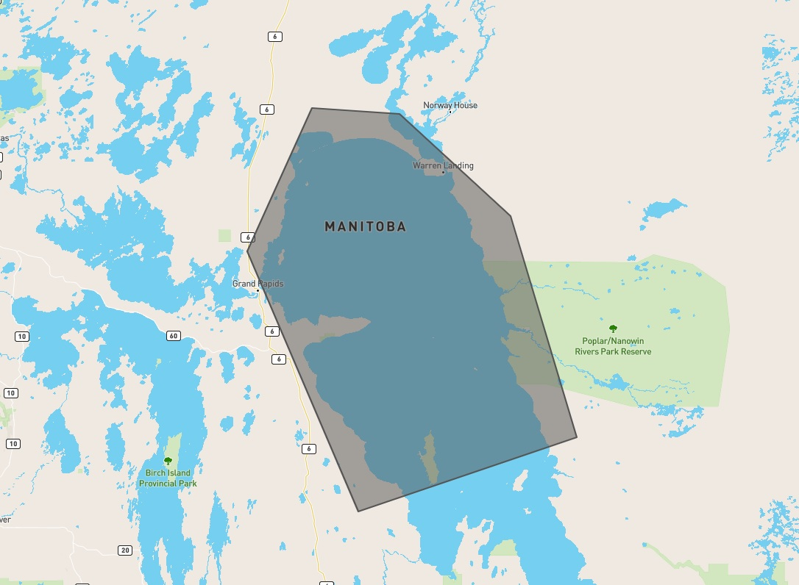

Example Usage
=============

Simple Example Paramset
-----------------------

Our study area is Northern Lake Winnipeg and we have constructed a geojson polygon using `geojson.io`_ (made possible by the folks at `Mapbox`_)

The geojson file that the above image displays can be found `here <_static/lakewinnipegnorth.geojson>`_

We are also only interested in **RCM** imagery from **August 15 2020** to **August 22 2020** for our analysis.

Command-Line Interface (CLI)
----------------------------

First we run a query to see what's available

.. code-block:: console

    $ eodms -c RCM -s 2020-08-15 -e 2020-08-22 -g lakewinnipegnorth.geojson --dump-results
    2020-12-23 10:34:09 | eodmsapi.cli | INFO | Querying EODMS API
    Fetching result metadata: 100%|████████████████████████████████| 26/26 [00:04<00:00,  5.30item/s]
    2020-12-23 10:34:18 | eodmsapi.cli | INFO | Finished query. 26 results
    2020-12-23 10:34:18 | eodmsapi.cli | INFO | Saving query results to file: ./query_results.geojson

We can then inspect the ``query_results.geojson`` in Python or GIS software (like `QGIS`_) to see if it satisfies our needs. If there are no modifications to be made, we can submit the order as-is

.. code-block:: console

    $ eodms -c RCM -s 2020-08-15 -e 2020-08-22 -g lakewinnipegnorth.geojson --submit-order

After order submission, you will receive emails from EODMS on the status of your order. Once your order status has changed to "Complete", take note of the ``Order ID`` in the Delivery Notification email and supply it to the CLI

.. code-block:: console

    $ eodms -c RCM --order-id <order_id>

Interactive Python
------------------

Just like in the command-line example, we first run a query to see what's available

.. code-block:: python

    >>> from eodms_api_client import EodmsAPI
    >>> client = EodmsAPI(collection='RCM')
    >>> client.query(start='2020-08-15', end='2020-08-22', geometry='lakewinnipegnorth.geojson')
    Fetching result metadata: 100%|████████████████████████████████| 26/26 [00:09<00:00,  2.70item/s]
    >>> len(client.results)
    26

Since we are already in Python, we can do some exploration of the results in order to filter out any scenes we won't be needing

.. code-block:: python

    # let's see what kind of beam modes are available
    >>> client.results.groupby('Beam Mode Type')['Granule'].agg('count')
    Beam Mode Type
    Medium Resolution 30m     2
    Medium Resolution 50m    23
    Quad-Polarization         1
    Name: Granule, dtype: int64

    # we like the sound of the 30m and quad-pol products. Let's subset to just those
    >>> subset = client.results.loc[client.results['Beam Mode Type'] != 'Medium Resolution 50m']
    >>> len(subset)
    3

    # let's make sure that the 3 scenes left have decent overlap with our area-of-interest (AOI)
    >>> import geopandas as gpd

    # project to meters (UTM 14N WGS84) for area calculations
    >>> aoi = gpd.read_file('lakewinnipegnorth.geojson').to_crs('epsg:32614') 
    >>> subset = subset.to_crs(aoi.crs)
    >>> subset['overlap_area'] = subset.intersection(aoi.unary_union).area
    >>> subset['overlap_pct'] = subset['overlap_area'] / subset.area
    >>> subset['overlap_pct']
    3     0.887386
    8     0.015402
    18    0.962696
    Name: overlap_pct, dtype: float64

    # there is 1 scene that has less than 2% of its area overlapping with our AOI
    # so let's remove it!
    >>> subset = subset.loc[subset['overlap_pct'] > 0.1]
    
    # now we extract the EODMS record Ids for our 2 scenes and submit our order
    >>> record_ids = subset['EODMS RecordId'].tolist()
    >>> order_ids = client.order(record_ids)

Same as with the CLI example, we wait for the "Order Complete" email and provide the ``Order Id`` to our client.

.. code-block:: python

    >>> client.download(order_id)

.. _geojson.io: https://geojson.io
.. _Mapbox: https://mapbox.com
.. _QGIS: https://qgis.org
